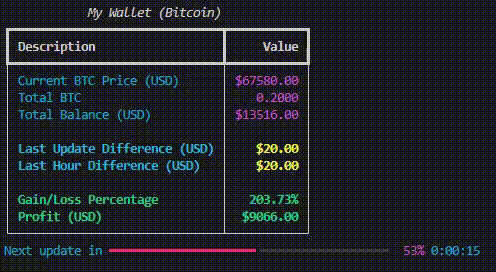

# Bitcoin Real-Time Tracker

A terminal application that reads Bitcoin transactions using the Binance API and displays real-time information such as balance, profit, and loss. The application continuously fetches the latest Bitcoin price and shows detailed statistics on your trades. **Please note that the transaction data used in this application is not real and is for demonstration purposes only.**

## Demonstration



## Features

- Real-time Bitcoin price tracking using the Binance API
- Displays balance, gain/loss percentage, and profit in USD
- Customizable transactions loaded from a configuration file (transactions.json)
- Clean and simple terminal interface with progress bar for updates

## Installation

To install and run the project locally, follow these steps:

### Clone the repository:
```
git clone https://github.com/your-username/bitcoin-real-time-tracker.git
cd bitcoin-real-time-tracker
```

### Install dependencies:
```
pip install -r requirements.txt
```

### Configuration:
You need to set up your transactions in the `transactions.json` file. **Remember that all transaction data is for testing and demonstration purposes only.**

Here is an example of the JSON file format:
```
{
  "transactions": [
    {
      "type": "buy",
      "value_in_usd": 30000,
      "quantity_in_btc": 0.1
    },
    {
      "type": "sell",
      "value_in_usd": 35000,
      "quantity_in_btc": 0.05
    },
    {
      "type": "buy",
      "value_in_usd": 32000,
      "quantity_in_btc": 0.1
    }
  ]
}
```

### Running the Application:
```
python bitcoin_tracker.py
```

The application will start reading the Bitcoin price in real-time, calculate the gains/losses, and display them in the terminal.

## Project Structure

```
├── bitcoin_tracker.py      # Main application script
├── transactions.json       # Transaction configuration file
├── README.md               # Project documentation
└── requirements.txt        # Dependencies file
```

## Requirements

The project requires the following Python packages:

- requests: To fetch Bitcoin prices from the Binance API
- rich: To create the terminal interface and progress bar

You can install these dependencies using the command:
```
pip install -r requirements.txt
```

## Usage Example

When running the application, you'll see output like this:

```
Bitcoin Summary
Description                        Value
Current BTC Price (USD)             $34300.45
Total BTC                           0.1500
Total Balance (USD)                 $5145.07

Last Update Difference (USD)        $-50.45
Last Hour Difference (USD)          $100.23

Gain/Loss Percentage                8.45%
Profit (USD)                        $345.07

Next update in: [███████████████▌]  50% [15s remaining]
```

## Future Enhancements

- Support for multiple currencies (e.g., EUR, BRL)
- Add graphical charts for price tracking
- Advanced portfolio management and insights

## Contribution

Contributions are welcome! Please follow the standard GitHub flow:

1. Fork the project.
2. Create a new feature branch (`git checkout -b feature/new-feature`).
3. Commit your changes (`git commit -m 'Add some feature'`).
4. Push to your branch (`git push origin feature/new-feature`).
5. Open a pull request.

## License

This project is licensed under the MIT License - see the LICENSE file for details.

## Contact

For any questions or suggestions, feel free to reach out:

- GitHub: [jrzmnt](https://github.com/jrzmnt)
